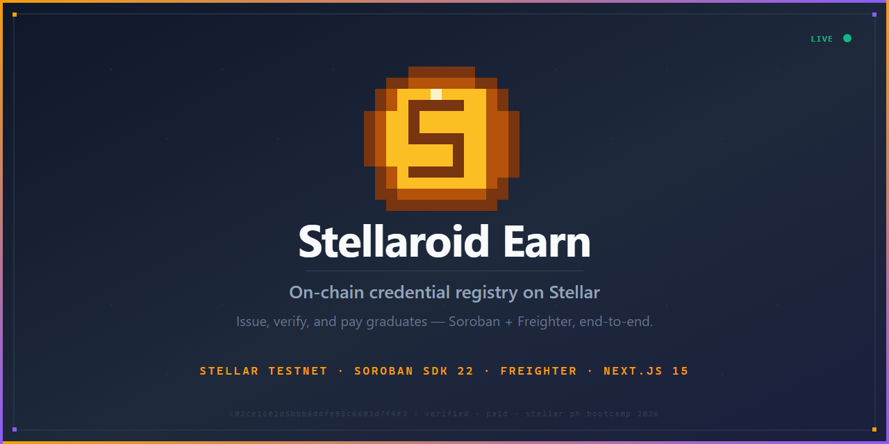
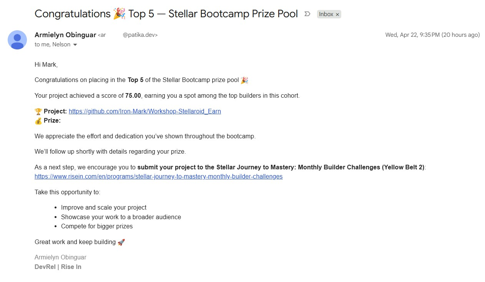
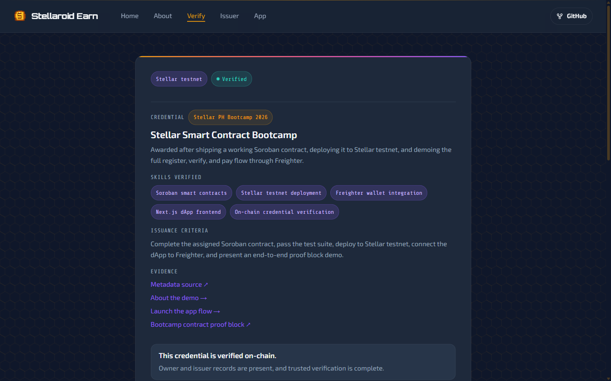
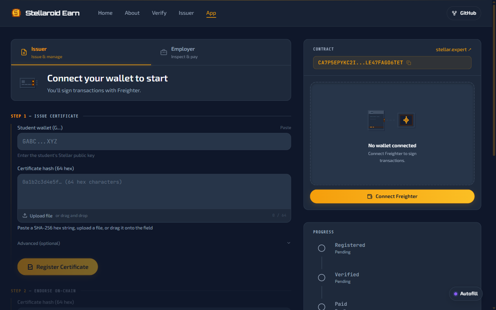
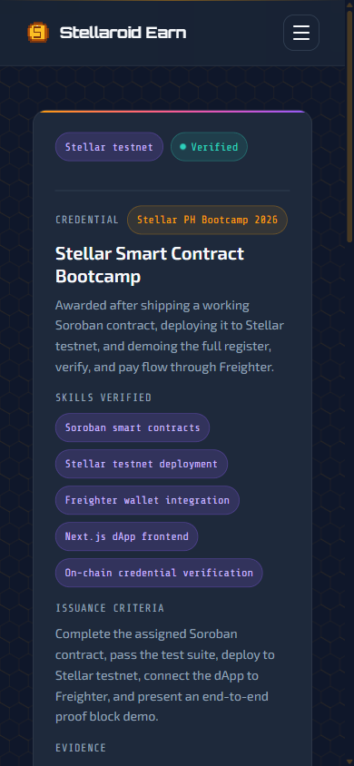
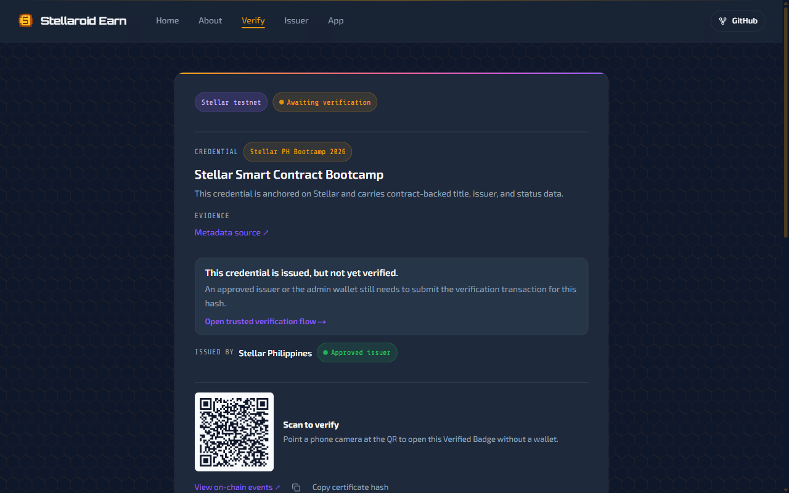
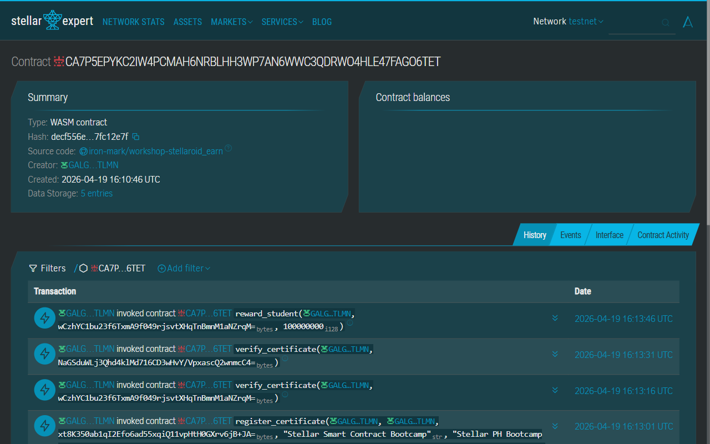
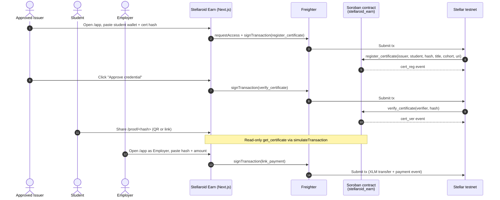

# Stellaroid Earn

**On-chain credential trust for Stellar PH Bootcamp 2026**

Issue, verify, and pay graduates on Stellar testnet  - Soroban + Freighter, end-to-end.

[](https://stellaroid.tech/)
[](https://stellar.expert/explorer/testnet/contract/CA7P5EPYKC2IW4PCMAH6NRBLHH3WP7AN6WWC3QDRWO4HLE47FAGO6TET)
[](https://docs.rs/soroban-sdk/22.0.0)
[](https://nextjs.org/)
[](LICENSE)



| | |
|---|---|
| **Live demo** | [stellaroid.tech](https://stellaroid.tech/) |
| **Contract (current)** | [`CA7P5EPYKC2IW4PCMAH6NRBLHH3WP7AN6WWC3QDRWO4HLE47FAGO6TET`](https://stellar.expert/explorer/testnet/contract/CA7P5EPYKC2IW4PCMAH6NRBLHH3WP7AN6WWC3QDRWO4HLE47FAGO6TET) |
| **Tx evidence** | [init](https://stellar.expert/explorer/testnet/tx/5f949662b430b059b71c9541a971852c527f869b537e123d3f3fb154f93c2e57) · [register](https://stellar.expert/explorer/testnet/tx/277075bbe55fc111f8c7888d72aa974eba5d1f596fa64900c466714ea57e320f) · [verify](https://stellar.expert/explorer/testnet/tx/47ad9094dff1895b68819afeb9b94f30146454c9d2ab1d580347e53139f7c896) · [payment](https://stellar.expert/explorer/testnet/tx/9a60bd71b8f37e89893480bda31c23ebf6deb080e2eb8912d43cf4cba42ebc4b) |
| **Source verified** | [Stellar Expert source validation](https://stellar.expert/explorer/testnet/contract/CA7P5EPYKC2IW4PCMAH6NRBLHH3WP7AN6WWC3QDRWO4HLE47FAGO6TET)  - WASM hash linked to [GitHub commit `71d2b03`](https://github.com/Iron-Mark/Workshop-Stellaroid_Earn/commit/71d2b032a7ca1da4e2b2e2d0186a940a17e542e0) |
| **Submission** | Rise In · Stellar Smart Contract Bootcamp · Stellar PH Bootcamp 2026 |
| **Result** | **Top 5 / 105 participants** · Score: 75.00 |



---

## Project Status

The bootcamp/event submission is complete. Stellaroid Earn is now maintained as a living Stellar credential proof project.

- **Roadmap:** [`ROADMAP.md`](ROADMAP.md)
- **Maintenance checks:** [`MAINTENANCE.md`](MAINTENANCE.md)
- **Custom domain cutover:** [`docs/STELLAROID_TECH_CUTOVER.md`](docs/STELLAROID_TECH_CUTOVER.md)
- **Canonical live URL:** [`stellaroid.tech`](https://stellaroid.tech/)
- **Operational status route:** [`/status`](https://stellaroid.tech/status)

`www.stellaroid.tech` and `earn.stellaroid.tech` redirect to the canonical apex URL.

---

## 30-Second Pitch

**Problem**  - Bootcamp certificates are PDFs that anyone can fake and no one can independently verify. Employers skip verification or pay for a background check service.

**Solution**  - Stellaroid Earn anchors credential hashes on a Soroban smart contract where approved issuers register and verify certificates, anyone checks proof at a public URL with no login, and employers pay graduates in XLM  - all on-chain.

**Why Stellar**  - Sub-cent fees and 5-second finality make issuing credentials cheap enough to never skip. `simulateTransaction` lets anyone verify with zero wallet setup. Native XLM via SAC closes the loop from proof to payout on one chain.

---

## Feature Gallery

<table>
<tr>
<td width="50%" align="center">
<br/>
<b>Discover</b>  - Landing page with 3-step how-it-works flow
</td>
<td width="50%" align="center">
<br/>
<b>Verify</b>  - On-chain credential with green Verified badge
</td>
</tr>
<tr>
<td width="50%" align="center">
<br/>
<b>Issue &amp; Pay</b>  - Dual-role dashboard for issuers and employers
</td>
<td width="50%" align="center">
<br/>
<b>Share</b>  - QR-scannable proof card on any mobile browser
</td>
</tr>
</table>

---

## Live Trust Artifact

Every credential produces a public **Verified Badge** URL  - no wallet, no login, no API key. Green means verified on-chain. Amber means issued but not yet verified.

<table>
<tr>
<td width="50%" align="center">
<br/>
<b>Verified</b><br/>
<a href="https://stellaroid.tech/proof/c02ce1602d5bbb6ddfe93c6603d7f4e3dae3b2fb571ea4e70669ccd5a359aea3">Try it yourself →</a>
</td>
<td width="50%" align="center">
<br/>
<b>Issued (locked)</b><br/>
<a href="https://stellaroid.tech/proof/c6df0adf9d1a6f5a88d847e8e9a779e71aa2435d6fa47b47d065ebbfa8c1f890">Try it yourself →</a>
</td>
</tr>
</table>

Contract on Stellar Expert: [`CA7P5EPY…GO6TET`](https://stellar.expert/explorer/testnet/contract/CA7P5EPYKC2IW4PCMAH6NRBLHH3WP7AN6WWC3QDRWO4HLE47FAGO6TET) (source verified)



---

## Architecture

> Full architecture document: [`docs/ARCHITECTURE.md`](docs/ARCHITECTURE.md)



**Design decisions:**

- **soroban-sdk 22** with typed `#[contracterror]` enum (12 variants), persistent + instance storage, TTL 518k/1.04M ledgers
- **Issuer trust layer**: self-register → admin approve → issue credentials. Suspended issuers are blocked on-chain
- **Two read paths**: server-side RSC with `revalidate=60` (CDN-cached proof pages) + client-side `simulateTransaction` (dashboard state)
- **One write path**: Freighter signs → `sendTransaction` → poll for result
- **CSP** locks `connect-src` to `*.stellar.org`  - no third-party data leaks

---

## Quick Start

### Prerequisites

- Rust (stable) + `wasm32v1-none` target
- [Stellar CLI v26+](https://developers.stellar.org/docs/tools/stellar-cli)
- Node.js 20+ and npm
- [Freighter](https://www.freighter.app/) browser extension set to **Testnet**

Full setup guide: [`setup/[ENG] Pre-Workshop Setup Guide.pdf`](setup/%5BENG%5D%20Pre-Workshop%20Setup%20Guide.pdf)

### Smart Contract

```bash
cd contract
cargo test                    # 6 tests pass
stellar contract build        # builds wasm32v1-none target

# Deploy to testnet
stellar keys generate my-key --network testnet --fund
stellar contract deploy \
  --wasm target/wasm32v1-none/release/stellaroid_earn.wasm \
  --source my-key --network testnet
```

### Frontend

```bash
cd frontend
cp .env.example .env.local    # fill in contract ID + read address
npm install
npm run dev                   # http://localhost:3000
```

**Environment variables** (`.env.local`):

```env
NEXT_PUBLIC_STELLAR_RPC_URL=https://soroban-testnet.stellar.org
NEXT_PUBLIC_STELLAR_NETWORK=TESTNET
NEXT_PUBLIC_STELLAR_NETWORK_PASSPHRASE=Test SDF Network ; September 2015
NEXT_PUBLIC_SOROBAN_CONTRACT_ID=<your deployed contract ID>
NEXT_PUBLIC_STELLAR_ADMIN_ADDRESS=<your admin G... address>
NEXT_PUBLIC_STELLAR_READ_ADDRESS=<any funded testnet address for read-only calls>
NEXT_PUBLIC_SOROBAN_ASSET_ADDRESS=CDLZFC3SYJYDZT7K67VZ75HPJVIEUVNIXF47ZG2FB2RMQQVU2HHGCYSC
NEXT_PUBLIC_SOROBAN_ASSET_CODE=XLM
NEXT_PUBLIC_SOROBAN_ASSET_DECIMALS=7
NEXT_PUBLIC_STELLAR_EXPLORER_URL=https://stellar.expert/explorer/testnet
```

---

## Verifiable On-Chain

Every action in the demo flow is a real transaction on Stellar testnet. Click any hash to verify on Stellar Expert.

| Action | Tx Hash | Result |
|---|---|---|
| `init` | [`5f949662…2e57`](https://stellar.expert/explorer/testnet/tx/5f949662b430b059b71c9541a971852c527f869b537e123d3f3fb154f93c2e57) | Contract initialized with admin + XLM token |
| `register_certificate` | [`277075bb…320f`](https://stellar.expert/explorer/testnet/tx/277075bbe55fc111f8c7888d72aa974eba5d1f596fa64900c466714ea57e320f) | Credential hash registered for student |
| `verify_certificate` | [`47ad9094…c896`](https://stellar.expert/explorer/testnet/tx/47ad9094dff1895b68819afeb9b94f30146454c9d2ab1d580347e53139f7c896) | Status changed to Verified |
| `reward_student` | [`9a60bd71…bc4b`](https://stellar.expert/explorer/testnet/tx/9a60bd71b8f37e89893480bda31c23ebf6deb080e2eb8912d43cf4cba42ebc4b) | Admin rewarded graduate 10 XLM |

**Live certificates** (testnet, contract [`CA7P5EPY…`](https://stellar.expert/explorer/testnet/contract/CA7P5EPYKC2IW4PCMAH6NRBLHH3WP7AN6WWC3QDRWO4HLE47FAGO6TET)):

| Hash | Cohort | Status |
|---|---|---|
| [`c02ce160…aea3`](https://stellaroid.tech/proof/c02ce1602d5bbb6ddfe93c6603d7f4e3dae3b2fb571ea4e70669ccd5a359aea3) | Stellar PH Bootcamp 2026 | Verified |
| [`35a19276…702e`](https://stellaroid.tech/proof/35a19276e58b8f742177892531def5e820f7c07bd8fd5a716ac710db09e6702e) | Stellar Philippines UniTour 2026 | Verified |
| [`c6df0adf…f890`](https://stellaroid.tech/proof/c6df0adf9d1a6f5a88d847e8e9a779e71aa2435d6fa47b47d065ebbfa8c1f890) | Stellar PH Bootcamp 2026 | Issued (locked demo) |

### Contract Functions

| Function | Caller | Description |
|---|---|---|
| `init(admin, token)` | Deployer | Initialize contract with admin address and XLM token |
| `register_issuer(address, name, website, category)` | Anyone | Submit issuer application (Pending status) |
| `approve_issuer(admin, issuer)` | Admin | Approve an issuer to register credentials |
| `suspend_issuer(admin, issuer)` | Admin | Suspend a misbehaving issuer |
| `get_issuer(issuer)` | Anyone | Read issuer record and status |
| `register_certificate(issuer, student, cert_hash, title, cohort, metadata_uri)` | Approved issuer | Register a credential hash for a graduate |
| `verify_certificate(issuer, cert_hash)` | Admin or issuer | Mark a credential Verified |
| `revoke_certificate(issuer, cert_hash)` | Admin or issuer | Permanently revoke a credential |
| `suspend_certificate(issuer, cert_hash)` | Admin or issuer | Temporarily suspend a credential |
| `reward_student(student, cert_hash, amount)` | Admin | Admin-initiated XLM payment to a graduate |
| `link_payment(employer, student, cert_hash, amount)` | Employer | Employer pays graduate in XLM, linked to credential |
| `get_certificate(cert_hash)` | Anyone | Read full credential record and status |

### Credential Status Lifecycle

```
Issued --> Verified  (issuer or admin calls verify_certificate)
       --> Revoked   (issuer or admin calls revoke_certificate)
       --> Suspended (issuer or admin calls suspend_certificate)
       --> Expired   (automatically after expires_at ledger sequence)
```

---

## Tests

6 tests covering the trust layer, access control, revocation, and events:

```
running 6 tests
test test::t1_happy_path_with_approved_issuer ... ok
test test::t2_unapproved_issuer_cannot_issue ... ok
test test::t3_suspended_issuer_cannot_issue ... ok
test test::t4_wrong_approved_issuer_cannot_verify ... ok
test test::t5_revoked_credential_blocks_payment ... ok
test test::t6_issuer_events_emit ... ok

test result: ok. 6 passed; 0 failed; 0 ignored
```

| Test | What it verifies |
|---|---|
| t1 | Happy path: approved issuer registers + verifies credential, admin rewards student |
| t2 | Pending (unapproved) issuer cannot register a credential |
| t3 | Suspended issuer cannot register a credential |
| t4 | Approved issuer A cannot verify issuer B's credential |
| t5 | Revoked credential blocks downstream payments |
| t6 | Events emitted correctly for init, register_issuer, approve_issuer |

---

## Security

Full security checklist: [`docs/SECURITY.md`](docs/SECURITY.md)

Covers: smart contract access control, frontend CSP/HSTS/X-Frame-Options, input validation, error normalization, SSRF prevention, and operational security. All items verified for testnet deployment.

---

## Advanced Feature: Fee Sponsorship (Gasless Transactions)

Stellaroid Earn implements **fee bump transactions** ([CAP-0015](https://stellar.org/protocol/cap-15)) so that a sponsor account can pay gas fees on behalf of users  - making credential verification and payment linking truly gasless.

**How it works:**

1. User signs a transaction normally via Freighter
2. The signed XDR is sent to `/api/fee-bump` (server-side)
3. Server wraps it in a `FeeBumpTransaction` signed by the sponsor keypair
4. The fee-bumped transaction is submitted to the network  - user pays zero fees

**Implementation:**
- Server route: [`frontend/src/app/api/fee-bump/route.ts`](frontend/src/app/api/fee-bump/route.ts)
- Client helper: [`frontend/src/lib/fee-bump.ts`](frontend/src/lib/fee-bump.ts)
- Config: `FEE_SPONSOR_SECRET` (server-only) + `NEXT_PUBLIC_FEE_SPONSOR_ADDRESS` (UI indicator)
- Graceful fallback: if sponsor is unavailable, transactions proceed with user-paid fees

---

## Metrics & Monitoring

- **Metrics dashboard:** [`/metrics`](https://stellaroid.tech/metrics)  - on-chain stats (events, proofs, transactions, certificates, rewards, payments) refreshed every 30s
- **Health endpoint:** [`/api/health`](https://stellaroid.tech/api/health)  - JSON health check (config, RPC latency, contract availability)
- **Events API:** [`/api/events`](https://stellaroid.tech/api/events)  - structured contract event data for external consumers
- **Vercel Analytics:** Web analytics integrated via `@vercel/analytics`

### Data Indexing

Contract events are indexed by querying Soroban RPC's `getEvents` method across a 60,000-ledger window (~2 days). Events are decoded from ScVal, categorized by kind (`cert_reg`, `cert_ver`, `reward`, `payment`), and served via the `/api/events` REST endpoint and the `/metrics` dashboard. The approach is lightweight and serverless  - no external indexer infrastructure required.

---

## Tech Stack

| Component | Version |
|---|---|
| Soroban SDK | 22.0.0 |
| Stellar CLI | 26+ |
| Next.js | 15 (App Router) |
| React | 19 |
| @stellar/stellar-sdk | latest |
| @stellar/freighter-api | latest |
| Tailwind CSS | v4 |

---

## Project Structure

```
stellaroid-earn/
├── contract/
│   ├── src/
│   │   ├── lib.rs              # Soroban credential + payment contract
│   │   └── test.rs             # 6 contract tests
│   └── Cargo.toml
├── frontend/
│   ├── src/
│   │   ├── app/                # Next.js App Router pages
│   │   │   ├── app/            # Participant dashboard (issuer + employer)
│   │   │   ├── issuer/         # Issuer registration + lookup
│   │   │   └── proof/[hash]/   # Public shareable verified badge
│   │   ├── components/         # UI components (proof card, wallet, badges)
│   │   ├── hooks/              # Freighter wallet state
│   │   └── lib/                # Contract client, RPC helpers, types
│   └── .env.example
├── demo/                       # Demo script, FAQ, press kit
├── scripts/                    # Screenshot capture (Playwright)
├── images/                     # README screenshots
├── LICENSE
└── README.md
```

---

## Demo Video

https://github.com/user-attachments/assets/stellaroid-earn-demo.mp4

> Full walkthrough: landing page → about → app dashboard (wallet connect) → issuer console → verified proof page → on-chain evidence on Stellar Expert.

Local copy: [`demo/stellaroid-earn-demo.mp4`](demo/stellaroid-earn-demo.mp4)

**Demo Day slides:** [`/slides`](https://stellaroid.tech/slides) (integrated into the app, arrow keys to navigate)

---

## User Validation

### Testnet Users

30+ users tested the MVP on Stellar testnet. Each wallet address is verifiable on [Stellar Expert](https://stellar.expert/explorer/testnet). 18 wallets have direct contract interactions (`register_issuer`), 12 are funded explorers.

<details>
<summary><strong>View all 30 wallet addresses</strong></summary>

| # | Wallet Address | Verified On-Chain |
|---|---------------|-------------------|
| 1 | `GCBBBLZVJVVM2ZMXPNMDN2ATH7AJ2H4BHOKA7JOJT6EMWTOKCGRKUK6I` | [Stellar Expert](https://stellar.expert/explorer/testnet/account/GCBBBLZVJVVM2ZMXPNMDN2ATH7AJ2H4BHOKA7JOJT6EMWTOKCGRKUK6I) |
| 2 | `GALGZBDSFG4FRTFSO7XLURBJRYC6PA34H73IF66G7BZOXXQDMWSHPXEU` | [Stellar Expert](https://stellar.expert/explorer/testnet/account/GALGZBDSFG4FRTFSO7XLURBJRYC6PA34H73IF66G7BZOXXQDMWSHPXEU) |
| 3 | `GAWJEP7LWY7WPLP7SBPR4MWQGQJIBAHVNVXYQE33F5FL2VFMFGBBFZ4B` | [Stellar Expert](https://stellar.expert/explorer/testnet/account/GAWJEP7LWY7WPLP7SBPR4MWQGQJIBAHVNVXYQE33F5FL2VFMFGBBFZ4B) |
| 4 | `GCBZAJUZXRHNLVR4RCG743KSTKQSVFKXQCNYWAH4FVHDVSS5IT6DWSI3` | [Stellar Expert](https://stellar.expert/explorer/testnet/account/GCBZAJUZXRHNLVR4RCG743KSTKQSVFKXQCNYWAH4FVHDVSS5IT6DWSI3) |
| 5 | `GAQZJQPZI7YZBUN6YVAFACVKAH6ODNBO3DVELP34VW4MLLUBCL5DMMNS` | [Stellar Expert](https://stellar.expert/explorer/testnet/account/GAQZJQPZI7YZBUN6YVAFACVKAH6ODNBO3DVELP34VW4MLLUBCL5DMMNS) |
| 6 | `GAYOZX7LSYYYROU4SEBKGOOHOPUWYORPXEDHZJOXZ5Q45XZED7IMXG2U` | [Stellar Expert](https://stellar.expert/explorer/testnet/account/GAYOZX7LSYYYROU4SEBKGOOHOPUWYORPXEDHZJOXZ5Q45XZED7IMXG2U) |
| 7 | `GDVNNL2QFO4PFYDLVLZTL2GKKOZR3YBV2AIIV7U44DXDOKKRJFIMLWCB` | [Stellar Expert](https://stellar.expert/explorer/testnet/account/GDVNNL2QFO4PFYDLVLZTL2GKKOZR3YBV2AIIV7U44DXDOKKRJFIMLWCB) |
| 8 | `GCFL24VJA3LPZLIOJ3AAVGCUGOW4A7ZUWNNEGR332IZ2MHMUWCTK3GVG` | [Stellar Expert](https://stellar.expert/explorer/testnet/account/GCFL24VJA3LPZLIOJ3AAVGCUGOW4A7ZUWNNEGR332IZ2MHMUWCTK3GVG) |
| 9 | `GBNVAVBVELOM2FBBPWDTUBM5DRECBY2MKPZ6YYO3CNKKSFCUUSE3HAU5` | [Stellar Expert](https://stellar.expert/explorer/testnet/account/GBNVAVBVELOM2FBBPWDTUBM5DRECBY2MKPZ6YYO3CNKKSFCUUSE3HAU5) |
| 10 | `GBWATJDBLCF7PPUQYBWBXCUQ5ZXRHKHZ7RAFHWZ4SLMNH45VBRPAXXYY` | [Stellar Expert](https://stellar.expert/explorer/testnet/account/GBWATJDBLCF7PPUQYBWBXCUQ5ZXRHKHZ7RAFHWZ4SLMNH45VBRPAXXYY) |
| 11 | `GDBJYDYLU3JH7V6X6KHPWQOSRQNXTL7OYTD6HUNVGB2J6Y7CUUX4WW6R` | [Stellar Expert](https://stellar.expert/explorer/testnet/account/GDBJYDYLU3JH7V6X6KHPWQOSRQNXTL7OYTD6HUNVGB2J6Y7CUUX4WW6R) |
| 12 | `GA6DCDZIIP3FGLIAU5FLUZLBBFCM6XD26JDJVJCA6EL2LKY5OKA7YAQF` | [Stellar Expert](https://stellar.expert/explorer/testnet/account/GA6DCDZIIP3FGLIAU5FLUZLBBFCM6XD26JDJVJCA6EL2LKY5OKA7YAQF) |
| 13 | `GBTNI3CULIDVJWABRYF5T56W7COYTA5JCRD3EAKO3VDSDWCUT2ZHSLAO` | [Stellar Expert](https://stellar.expert/explorer/testnet/account/GBTNI3CULIDVJWABRYF5T56W7COYTA5JCRD3EAKO3VDSDWCUT2ZHSLAO) |
| 14 | `GD2PSTZL2YQC66C4PGFS5D64A6473IEKCZKNMIM5B7JWVLVS2N27D7QU` | [Stellar Expert](https://stellar.expert/explorer/testnet/account/GD2PSTZL2YQC66C4PGFS5D64A6473IEKCZKNMIM5B7JWVLVS2N27D7QU) |
| 15 | `GCZJCXZTC5KELSLQJU6QUIDMRZ2HFTUIDYL3PCOKGR7XRAFI373DO6PU` | [Stellar Expert](https://stellar.expert/explorer/testnet/account/GCZJCXZTC5KELSLQJU6QUIDMRZ2HFTUIDYL3PCOKGR7XRAFI373DO6PU) |
| 16 | `GCD4WRBPCKIPMDKLQA2LRAGYOIWCVRXJI4XNW4TI2ECVNKQO3T2XUSHG` | [Stellar Expert](https://stellar.expert/explorer/testnet/account/GCD4WRBPCKIPMDKLQA2LRAGYOIWCVRXJI4XNW4TI2ECVNKQO3T2XUSHG) |
| 17 | `GBJXD5H457AKCFEGTSKYMD4MRSBBMGTUCOKEBU6YQ7TKNZ7SY2W37KKY` | [Stellar Expert](https://stellar.expert/explorer/testnet/account/GBJXD5H457AKCFEGTSKYMD4MRSBBMGTUCOKEBU6YQ7TKNZ7SY2W37KKY) |
| 18 | `GAGR7D5K4VL5HNOZCL6CYZIGT5FNYZW7I5WXGX6HSBZLLVQ3NG77XBAO` | [Stellar Expert](https://stellar.expert/explorer/testnet/account/GAGR7D5K4VL5HNOZCL6CYZIGT5FNYZW7I5WXGX6HSBZLLVQ3NG77XBAO) |
| 19 | `GAZXPBADNPTKWAGUWZM6KWEMIO4MQVU4GW3ZJXKHEO4BOBL5SLERSQYR` | [Stellar Expert](https://stellar.expert/explorer/testnet/account/GAZXPBADNPTKWAGUWZM6KWEMIO4MQVU4GW3ZJXKHEO4BOBL5SLERSQYR) |
| 20 | `GDANCIDPUHS4IQUNHRM5RNKVOXTRR5RKIYYEE7HVPB2RWD76J66CS2DH` | [Stellar Expert](https://stellar.expert/explorer/testnet/account/GDANCIDPUHS4IQUNHRM5RNKVOXTRR5RKIYYEE7HVPB2RWD76J66CS2DH) |
| 21 | `GCHZOQCDMG5J6NC2MNAR6EH5JFGI6JEP7TQWWUDRWER75Q3W3NC52HMG` | [Stellar Expert](https://stellar.expert/explorer/testnet/account/GCHZOQCDMG5J6NC2MNAR6EH5JFGI6JEP7TQWWUDRWER75Q3W3NC52HMG) |
| 22 | `GC54CLYWNJ2AQZCAA2LVXOR2XTNGGCZYDSEJLLQBV6D4EDXN6D6DFGPX` | [Stellar Expert](https://stellar.expert/explorer/testnet/account/GC54CLYWNJ2AQZCAA2LVXOR2XTNGGCZYDSEJLLQBV6D4EDXN6D6DFGPX) |
| 23 | `GDTJBRZXXMOWPF3LPMM7V4WOBIPLGR6BXTRDBYH6VCBRBL5Y76NK5JHY` | [Stellar Expert](https://stellar.expert/explorer/testnet/account/GDTJBRZXXMOWPF3LPMM7V4WOBIPLGR6BXTRDBYH6VCBRBL5Y76NK5JHY) |
| 24 | `GDK5LNJFLU5LLNQDDZJ4SUPXASK7SULASCAGEHF5IT65FX2FYZ56CHAM` | [Stellar Expert](https://stellar.expert/explorer/testnet/account/GDK5LNJFLU5LLNQDDZJ4SUPXASK7SULASCAGEHF5IT65FX2FYZ56CHAM) |
| 25 | `GBTY2BMYVRP2SFSFJXMHFQ6XQOKUS5JEZEAF3ZI5356FK7EQN56G57QE` | [Stellar Expert](https://stellar.expert/explorer/testnet/account/GBTY2BMYVRP2SFSFJXMHFQ6XQOKUS5JEZEAF3ZI5356FK7EQN56G57QE) |
| 26 | `GANDLIFPFLNRYMIK6PG3BQU437PVUDLKS2VBCBYAMCJOKYZPRJWGORSU` | [Stellar Expert](https://stellar.expert/explorer/testnet/account/GANDLIFPFLNRYMIK6PG3BQU437PVUDLKS2VBCBYAMCJOKYZPRJWGORSU) |
| 27 | `GAVCDYPJLPA2W4EYIMDXPSGAMUJDDOCSGNVZAX7UER4B4AKLVSDZSEIT` | [Stellar Expert](https://stellar.expert/explorer/testnet/account/GAVCDYPJLPA2W4EYIMDXPSGAMUJDDOCSGNVZAX7UER4B4AKLVSDZSEIT) |
| 28 | `GARXSQZMDE4YF5IL6TWDAF4IAQG326JWAMOB5MAVAM3BOTXKM47Q6AQC` | [Stellar Expert](https://stellar.expert/explorer/testnet/account/GARXSQZMDE4YF5IL6TWDAF4IAQG326JWAMOB5MAVAM3BOTXKM47Q6AQC) |
| 29 | `GBS6ERMNCYSO2EK7VPAGJP6TI6IEKGRJNUTKZWJ7KDBLY7Y6MG3CFEWF` | [Stellar Expert](https://stellar.expert/explorer/testnet/account/GBS6ERMNCYSO2EK7VPAGJP6TI6IEKGRJNUTKZWJ7KDBLY7Y6MG3CFEWF) |
| 30 | `GCOON62FGOWAW44SAWI3UKNJY52W7RD4CIBEQFZJEI2J56MWOCKUENAC` | [Stellar Expert](https://stellar.expert/explorer/testnet/account/GCOON62FGOWAW44SAWI3UKNJY52W7RD4CIBEQFZJEI2J56MWOCKUENAC) |

</details>

### Feedback Collection

- **Google Form:** [Stellaroid Earn - User Feedback Form](https://docs.google.com/forms/d/e/1FAIpQLSftFt8grSRUPecRVQWSRROLA8DAUOn4T61CrZQHtPQaMTxaWw/viewform)
- **Exported responses:** [`docs/user-feedback-responses.csv`](docs/user-feedback-responses.csv)
- **Full feedback documentation:** [`docs/USER_FEEDBACK.md`](docs/USER_FEEDBACK.md)

### Improvements Based on Feedback

After collecting feedback from testnet users, the following iteration was completed:

| Feedback | Improvement | Commit |
|----------|-------------|--------|
| Users confused about which role (Issuer vs Employer) to pick after connecting wallet | Added contextual role guidance hints below the persona toggle | [`c1450bf`](https://github.com/Iron-Mark/Workshop-Stellaroid_Earn/commit/c1450bf) |

---

## Community Contribution

[](https://www.threads.com/@iron_markk/post/DXeJNnlkgLF)

---

## Built By

**Mark Siazon**  - Hybrid Product Designer & Full-Stack Developer

[](https://www.marksiazon.dev/)
[](https://www.linkedin.com/in/mark-siazon/)<br>
[](https://github.com/Iron-Mark)   
[](https://github.com/mark-siazon)

## Acknowledgments

- [Rise In](https://www.risein.com/programs)  - Stellar Smart Contract Bootcamp
- [Stellar Philippines](https://stellar.org/)  - Stellar PH Bootcamp 2026
- [Workflow PH](https://www.facebook.com/WorkFlowPH/)  - Community partner
- [Stellar Docs](https://developers.stellar.org) · [Soroban SDK](https://docs.rs/soroban-sdk) · [Freighter](https://www.freighter.app/) · [Stellar Expert](https://stellar.expert/explorer/testnet)

---

MIT License  - see [LICENSE](LICENSE) for details.
