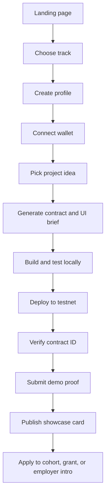
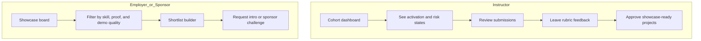
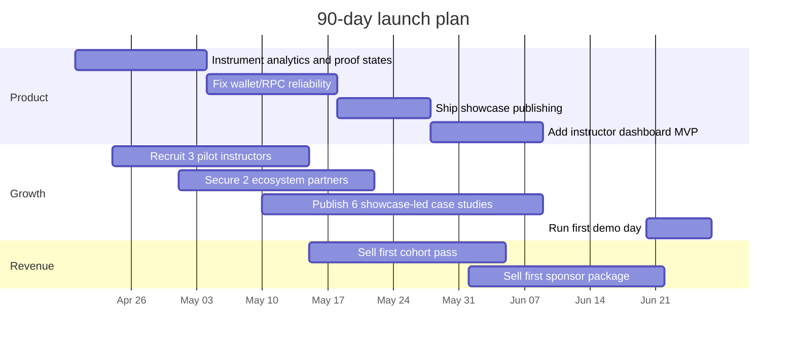
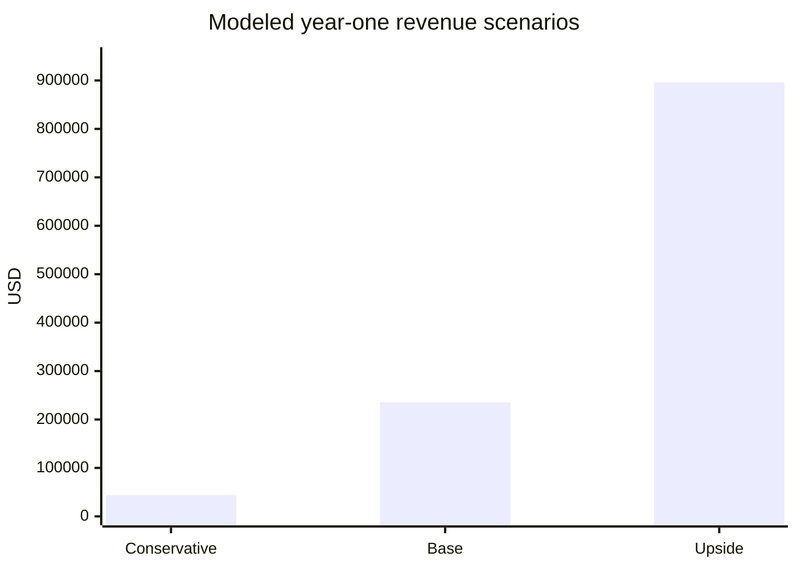

# Making the Stellar Bootcamp MVP Successful in April 2026

## Executive summary

The hard truth is this: the MVP should **not** try to win as a generic learning platform, a generic LMS, or a generic browser IDE. In April 2026, it has a real shot only if it becomes the **fastest path from idea → verified Soroban demo → public proof of work → funding or hiring signal** for builders entering the Stellar ecosystem. That wedge is defensible because the ecosystem still has active bootcamps, hackathons, and funding rails, while the strongest substitutes either teach broadly, manage classroom workflow, or provide raw coding infrastructure rather than a Stellar-native “ship something real” operating system. The strongest evidence I could inspect directly from the repo context is the uploaded fullstack prompt artifact, which is strongly oriented around Soroban SDK 22+, the `stellar` CLI, testnet deployment, contract-ready output, and a `frontend/` flow built around Next.js and Freighter. I could not retrieve the live repository pages, commit history, issues, or CI workflow files from the provided repository URL in this environment, so the technical audit below is necessarily **evidence-based but partly inferential**, anchored in that artifact and current official platform documentation rather than a complete line-by-line code review. fileciteturn0file0 citeturn20view0turn21view0turn23search3turn23search14turn23search4turn23search0

The opportunity is real. The entity["organization","Stellar Development Foundation","blockchain nonprofit"] has entered 2026 with explicit growth targets around real economic activity, new enterprise deployments, and builder ecosystem expansion; active funding rails remain available through the Stellar Community Fund with build awards of up to $150K; and public ecosystem programming in April 2026 shows active “Build on Stellar” bootcamps in places like the Philippines and Indonesia via entity["organization","Rise In","developer education"] and partner communities. That means the problem is **not** lack of ecosystem oxygen. The problem is that most early builder products still die in the gap between “I’m interested” and “I shipped something credible.” Your MVP should exist to compress that gap. citeturn32search0turn32search3turn17search2turn13search2turn32search1

The most likely user stack is not one segment but four linked segments. The primary user is the **student or early-career builder** who wants to go from zero to a working testnet proof quickly. The second is the **bootcamp applicant** who wants help generating a credible project direction and portfolio evidence before or during application. The third is the **instructor or mentor** who needs cohort visibility, rubrics, and lower review overhead. The fourth is the **employer, sponsor, or ecosystem operator** who wants a filtered stream of working demos and promising builders. Those assumptions fit both the uploaded artifact and the current market reality that developers learn online, prefer official docs and interactive tooling, and younger learners increasingly favor social and challenge-based formats over passive content alone. fileciteturn0file0 citeturn27search2turn27search6turn27search1turn27search3

If you execute correctly, the product should be positioned as a **bootcamp operating system for onchain builders**. That means: free or near-free student entry, strong project scaffolding, deterministic progress states, mandatory proof blocks, mentor workflows, and a public showcase layer that converts course completion into ecosystem value. Monetization should come laterally—through cohort upgrades, instructor licenses, sponsor packages, and talent/demo-day access—not by trying to charge price-sensitive students high tuition up front. That recommendation is reinforced by the pricing anchors in the market: broad education platforms like entity["company","Coursera","online learning platform"] and entity["company","Udemy","online learning platform"] already offer large content libraries cheaply; classroom tooling like GitHub Classroom is free; and developer tooling platforms like entity["company","Replit","cloud ide platform"] and entity["company","Alchemy","blockchain developer platform"] either monetize infrastructure or give away education to feed their broader platform. You win only by owning the **“ship, verify, showcase”** lane. citeturn28search6turn28search3turn29search0turn29search4turn28search0turn30search3turn34search0

My recommendation stack is simple. **P0** is instrumentation, core activation flow, deterministic CI, wallet and RPC reliability, and proof-of-work publishing. **P1** is mentor and instructor workflow, cohort analytics, feature flags, retention loops, and public showcase distribution. **P2** is employer matching, sponsor rails, campus partnerships, and differentiated ecosystem data. If you do not fix activation, proof, and reliability first, all marketing is fake progress. If you do fix them, this can become a credible on-ramp product in the Stellar builder ecosystem by the end of Q3 2026. citeturn24search12turn24search2turn33search2turn25search0turn26search0turn23search15

## Assumptions and evidence base

I need to be explicit about the evidence boundary. I could not retrieve the repository’s live code pages, issues, commits, or workflow files from the provided repository URL in this environment, so I cannot honestly claim a full direct code audit of the active `dev` branch. What I **could** inspect directly from your side was the uploaded “Fullstack Prompt Template,” which references Soroban SDK 22.0.0, the `stellar` CLI rather than the deprecated `soroban` CLI, Stellar testnet deployment, a contract/package structure, and a Next.js 15 + Freighter-oriented frontend brief. I therefore treat the deliverable below as a **working operator report for the likely MVP shape**, not a fantasy “I saw every line of the repo” audit. fileciteturn0file0 citeturn20view0turn21view0turn23search3turn23search11turn23search4turn23search0

The most probable product assumptions I used are these. First, the app serves a Stellar/Soroban bootcamp or hackathon-builder journey rather than a generic learning catalog. Second, the user’s success event is not “watched content” but “produced a verified onchain demo and can present it.” Third, the frontend likely uses a modern React/Next stack and wallet-mediated transaction signing. Fourth, the contract side is Rust/Soroban and testnet-first. Fifth, the target market is global but developer-heavy, with likely initial traction in university communities, hackathons, and ecosystem programs rather than enterprise L&D. These assumptions are directly compatible with the uploaded artifact and current platform docs. fileciteturn0file0 citeturn23search16turn23search14turn23search15turn32search8turn17search5

The likely user personas are below.

| Persona | Core job-to-be-done | Pain today | What they will pay or trade for |
|---|---|---|---|
| Student builder | Ship a testnet demo fast enough to stay motivated | Too many moving parts, unclear next step, wallet/RPC friction | Attention, referrals, small subscription, cohort fee |
| Bootcamp applicant | Turn vague interest into a credible application or portfolio | No project idea, no proof, no “why Stellar” story | Low one-time upgrade, free tier preferred |
| Instructor or mentor | Track cohort progress and review work without chaos | Spreadsheet hell, weak rubric visibility, no progress telemetry | Course or campus license |
| Employer or sponsor | Find promising builders and working demos | Too much noise, no standardized proof, weak portfolio quality | Sponsorship, talent access, branded challenge fee |

These personas align with the fact that developers still learn heavily through online resources, prefer API/SDK documentation, and younger learners increasingly want interactive or challenge-based formats; they also align with the active public Stellar ecosystem programs available to new builders right now. citeturn27search2turn27search6turn27search3turn17search2turn32search3turn32search1

## Technical audit

### Architecture and stack judgment

Assuming the artifact reflects the repo’s actual direction, the product should be treated as a **bimodal system**: a web application layer for education, workflow, and analytics, and a smart-contract layer for the onchain demo path. That is the right shape. Next.js App Router is a strong fit for content, authenticated dashboards, hybrid rendering, and route-level composition, while Soroban’s Rust-based contract model and the Stellar CLI give you a correct path for deterministic build, test, deploy, and contract invocation flows. Freighter’s `signTransaction` flow is also the right wallet integration primitive for a demo-first builder product. fileciteturn0file0 citeturn23search0turn23search1turn23search3turn23search10turn23search14turn23search15turn23search16

Where the technical risk likely sits is not in basic stack choice but in the seams: wallet UX, RPC reliability, environment and secret handling, contract/frontend version drift, and absent CI discipline. Soroban/CLI workflows are mature enough to support build-test-deploy loops, but without deterministic CI, pinned toolchains, end-to-end tests, and clear failure states around signing/submission, the product will feel flaky precisely where new builders are least tolerant. On the frontend side, Next.js is fine, but production deployment should default to a Node/Vercel-compatible path with explicit support for performance budgets, preview deployments, and observability from day one. citeturn23search1turn23search9turn24search10turn24search12turn24search2turn25search0turn26search9

My technical verdict is therefore blunt: **the likely architecture is directionally correct, but the MVP will fail commercially if reliability, testability, and instrumentation are treated as “post-launch” work.** This category is not forgiving. If a student loses momentum at wallet connect, deploy, verify, or submit, they do not come back and write you a thoughtful support ticket. They bounce. citeturn23search15turn24search9turn24search0turn24search2

### Recommended deployment and observability baseline

The fastest sane baseline is to run the web app on entity["company","Vercel","cloud platform"] with preview deployments, Web Analytics, Speed Insights, and built-in observability; use feature flags for controlled launches and A/B tests; and instrument product events in either entity["company","PostHog","product analytics"] or entity["company","Mixpanel","product analytics"] depending on your team’s preference for all-in-one product ops versus more classic analytics reporting. Vercel now has native feature flags and an explicit A/B testing workflow, while PostHog and Mixpanel both provide startup-friendly pricing with free tiers large enough for an MVP. citeturn24search10turn24search12turn24search2turn33search2turn33search0turn24search9turn33search1turn33search18

### Prioritized backlog

The table below is a **modeled, prioritized backlog** based on the accessible artifact and current official docs, not on direct inspection of your actual issue tracker.

| Priority | Work item | Why now | Effort | Impact | Delivery risk |
|---|---|---|---|---|---|
| P0 | End-to-end CI for frontend + contract build/test | Prevent silent breakage between web and contract surfaces | M | Very high | Low |
| P0 | Pin Node, Rust, `stellar` CLI, Soroban SDK versions | Reduce cross-machine inconsistency | S | High | Low |
| P0 | Wallet reliability layer with explicit signing, submit, retry, and explorer links | Activation dies here if UX is muddy | M | Very high | Medium |
| P0 | RPC abstraction with fallback provider and timeout states | Testnet latency will kill demos | M | Very high | Medium |
| P0 | Product analytics event taxonomy | You cannot improve what you cannot see | S | Very high | Low |
| P0 | Error monitoring + traces + session replay | Fast debugging of onboarding failures | S | High | Low |
| P0 | “Proof block” publishing: contract ID, repo, demo, rubric, status | Converts coursework into shareable value | M | Very high | Medium |
| P1 | Instructor dashboard with cohort health and review queue | Turns product into something instructors can adopt | M | High | Medium |
| P1 | Gated feature flags and experiment framework | Lets you ship without chaos | S | High | Low |
| P1 | E2E tests for connect wallet → deploy → verify → submit | Protect the core funnel | M | High | Medium |
| P1 | PWA/mobile optimization | Students discover and check status on phones | M | Medium | Low |
| P2 | Employer showcase and sponsor challenge rails | Important monetization, but not day-one survival | L | High | Medium |
| P2 | Campus ambassador and referral system | Growth multiplier after activation is fixed | M | Medium | Medium |

The highest-leverage items are the ones that make the “builder path” deterministic: CI, pinned versions, fallback RPC behavior, strong wallet feedback, and proof publishing. Everything else is downstream. fileciteturn0file0 citeturn23search9turn23search11turn23search15turn24search10turn24search2turn25search0turn26search0

### Code-level example

A minimal CI baseline should look like this:

```yaml
name: ci

on:
  pull_request:
  push:
    branches: [main, dev]

jobs:
  web:
    runs-on: ubuntu-latest
    steps:
      - uses: actions/checkout@v4
      - uses: actions/setup-node@v4
        with:
          node-version: 20.9
          cache: pnpm
      - run: corepack enable
      - run: pnpm install --frozen-lockfile
      - run: pnpm lint
      - run: pnpm test
      - run: pnpm build

  contract:
    runs-on: ubuntu-latest
    steps:
      - uses: actions/checkout@v4
      - uses: dtolnay/rust-toolchain@stable
      - run: rustup target add wasm32-unknown-unknown
      - run: cargo test --manifest-path contract/Cargo.toml
      - run: stellar contract build --manifest-path contract/Cargo.toml
```

And your deploy pipeline should use short-lived credentials via OIDC rather than long-lived cloud secrets. That is standard hardening, and it matters even for an MVP because student-heavy products tend to accumulate bad secret hygiene fast if you do not set the rule early. citeturn23search9turn23search1turn23search3turn25search0turn25search6turn25search4

## Product and UX critique

### Product focus

The current product concept, inferred from the artifact, is most powerful when it is centered on **outcomes**, not content volume. That means the canonical object in the app should be the **project**, not the lesson. A student should feel, from the first minute, that the product is helping them produce a public artifact with increasing credibility: problem definition, chosen track, contract progress, deployment state, demo proof, rubric score, and publishable showcase card. Every other UX decision should serve that. fileciteturn0file0

That implies a ruthless feature cut. The first release should prioritize only five core outcomes: account creation, track selection, wallet connect, guided build-and-verify flow, and public proof publishing. Live chat, broad forums, content libraries, badges, and “community feeds” are P2 or later unless they directly improve activation or retention. Younger builders do like interactive and social formats, but that does **not** mean a dashboard full of noise; it means structured challenge loops, visible progress, and feedback at the right moment. citeturn27search3turn27search1turn31search1turn28search0

### Suggested journey maps

The student journey should look like this:



The instructor and employer path should look like this:



The key UX principle behind both maps is the same: **every screen should answer one question—what is the next action that increases proof?** That is what separates a real builder product from decorative edtech. fileciteturn0file0 citeturn28search0turn31search1turn24search0turn24search12

### Analytics events and experiments

Your analytics taxonomy should be sparse, opinionated, and tied to business outcomes. Start with this event model:

| Event | Trigger | Core properties | KPI tied to it |
|---|---|---|---|
| `landing_cta_clicked` | Hero CTA tap | referrer, device, campaign | Visitor-to-signup rate |
| `track_selected` | User picks path | track, skill level | Intent quality |
| `wallet_connect_started` | Connect flow opens | wallet_type, device | Activation friction |
| `wallet_connect_success` | Wallet connected | wallet_type, duration | Activated user rate |
| `idea_generated` | Project brief generated | theme, region, persona | Early value moment |
| `contract_build_started` | Build step begins | local/remote, sdk_version | Funnel depth |
| `contract_verified` | Testnet contract verified | contract_type, duration | Proof completion |
| `demo_submitted` | User submits evidence | video_present, repo_present | Submission completion |
| `showcase_published` | Project card goes live | rubric_score, mentor_approved | Shareable output rate |
| `intro_requested` | Employer/sponsor interest | source, project_type | Monetizable demand |

A/B tests should likewise be few and brutal. Test only things that touch activation or proof rate: whether “Connect wallet” is above or below the fold; whether you ask users to choose a track before or after wallet connect; whether a project template gallery outperforms a blank prompt box; whether green “proof” status language increases submission completion; whether a visible “contract verified” badge increases showcase publishing. Vercel’s flags and A/B flows are now capable enough for an MVP to run these tests without adding unnecessary operational complexity. citeturn24search12turn33search2turn33search0turn24search0turn33search1

For design inspiration, borrow the clarity of structured learning dashboards, the immediacy of coding workspaces, and the simplicity of progress-first flows rather than trying to invent a “creative” layout from scratch.

image_group{"layout":"carousel","aspect_ratio":"16:9","query":["Coursera learner dashboard interface", "GitHub Classroom dashboard interface", "Replit workspace interface", "Alchemy University learning platform"], "num_per_query": 1}

A sample direction for your UI is here: [Download the sample UI mockup](sandbox:/mnt/data/stellar_bootcamp_mvp_mockup.png)

### Wireframe and UI improvement advice

The interface should be organized around three visible blocks. First, a **Next Action** card that states one task and one button. Second, a **Milestones** panel that shows the project’s proof state in plain language. Third, a **Portfolio Proof Block** that aggregates the demo video, repo health, contract verification, and showcase status into something publishable. If the home screen is anything else—too much content, too many filters, too much navigation—you are optimizing for browsing, not shipping. fileciteturn0file0

## Marketing and growth

### Positioning

The best positioning line is: **“From Stellar idea to verified demo in days, not weeks.”** Do not market this as “learn blockchain” or “join a bootcamp platform.” That lane is crowded and weaker players get crushed there. Instead, position it as the shortest path from interest to public proof for builders, and the cleanest path from builder activity to cohort visibility for mentors, sponsors, and employers. Public competitor reality supports this choice: Rise In is already large and free; Alchemy University is free and content-rich; GitHub Classroom is strong for assignment workflow; Coursera and Udemy dominate broad content. Your wedge must be output quality and ecosystem fit, not library size. citeturn28search13turn34search0turn28search0turn28search6turn29search0

### Pricing models

The pricing model should follow the market, not your ego. Students are already surrounded by cheap or free learning offers, so the recommended model is:

| Layer | Recommended price | Why it works |
|---|---|---|
| Free builder tier | $0 | Needed to compete with free ecosystem education |
| Cohort pass | $49–$99 one-time | Acceptable for guided accountability, reviews, certificate, and demo day |
| Builder Pro | $12/month or $99/year | Reasonable for advanced templates, portfolio analytics, private drafts, mentor notes |
| Instructor/campus license | $500–$2,500 per cohort | Clear ROI through cohort visibility and reduced admin overhead |
| Sponsor/employer package | $3,000–$10,000 per challenge/demo day | Monetizes talent access and branded distribution |

That pricing logic is anchored by the market’s very obvious signal: consumer learning is cheap, classroom tooling is frequently free, and dev infrastructure monetizes elsewhere. So your student offer must stay low-friction while B2B and sponsor value funds the serious expansion. citeturn28search6turn28search3turn29search0turn29search4turn28search0turn30search3turn34search0

### Channels and partnership plan

Your first growth channels should be ecosystem-native, not broad paid acquisition. Prioritize regional Stellar bootcamps, university hackathons, student communities, GitHub Education circles, and the Stellar Community Fund pipeline. The reasons are simple: the audience is already warm, price-sensitive, and outcome-motivated; channel CAC is lower; and partner credibility is much stronger than cold ads. Public April 2026 ecosystem signals show active bootcamp demand in multiple regions, and the GitHub Student Developer Pack remains a strong student acquisition adjacency. citeturn17search2turn13search2turn32search1turn32search3turn31search1

The channel order should therefore be:
1. Stellar ecosystem partnerships and community funds  
2. Campus organizations and hackathon co-hosts  
3. Instructor-led pilots with one cohort at a time  
4. Showcase-led content marketing built from student projects  
5. Only then: paid acquisition, mostly retargeting, not broad top-of-funnel ads

### Competitor matrix

| Product | Core use case | Pricing anchor | Strength | Gap your MVP can exploit |
|---|---|---|---|---|
| entity["organization","Rise In","developer education"] | Web3 bootcamps, events, acceleration | Free | Large builder audience, active Stellar programs | Does not own your project-proof workflow by default |
| entity["company","Alchemy","blockchain developer platform"] University | Free web3 education | Free | Strong content, scale, recognizable brand | EVM-centric, not a Stellar-native proof system |
| GitHub Classroom | Assignment management and autograding | Free | Excellent instructor workflow | Weak on wallet/onchain/demo showcase |
| entity["company","Coursera","online learning platform"] | Broad professional upskilling | $59/mo or $399/yr list, frequent promos | Content breadth and brand trust | Not project-proof-first for onchain builders |
| entity["company","Udemy","online learning platform"] | Self-paced course marketplace | Subscription plus one-off courses | Massive catalog and low cost | Weak cohort accountability and weak Stellar specificity |
| entity["company","Replit","cloud ide platform"] | Browser dev environment and deployment | $20/mo Core, higher for teams | Fast build environment | Not a bootcamp operating system or ecosystem showcase |

The table synthesizes official product pages and pricing anchors from the current public market. citeturn28search13turn34search0turn28search0turn28search6turn29search0turn29search4turn30search3

### Launch plan for the next 90 days



The only KPIs that matter in this first 90-day window are: signup-to-wallet-connect rate, wallet-connect-to-contract-verify rate, verify-to-showcase-publish rate, cohort completion rate, and partner-led acquisition share. If you optimize vanity traffic before these, you are cosplaying growth. citeturn24search12turn24search2turn33search2turn32search3turn31search1

## Business model and metrics

### Business model recommendation

The business model should be **free student acquisition + premium accountability + B2B capture of the value created**. In plain English: let students in cheaply, help them produce a public artifact, then monetize the parties who benefit most from that artifact—campus operators, instructors, ecosystem programs, sponsors, and employers. That is much more defensible than attempting to charge content-library-style tuition in a market where strong alternatives are already free or cheap. citeturn28search13turn34search0turn28search6turn29search0

### Unit economics model

The figures below are **modeled planning inputs**, not external market facts. They are meant to help you steer the business.

| Metric | Conservative planning input | Base planning input | Upside planning input |
|---|---:|---:|---:|
| Annual signup volume | 5,000 | 20,000 | 60,000 |
| Paid builder conversion | 4% | 6% | 8% |
| Effective paid builder ARPU/year | $60 | $72 | $79 |
| Cohort enrollments/year | 200 | 1,000 | 3,000 |
| Average cohort pass | $79 | $79 | $99 |
| Instructor/campus revenue/year | $6,000 | $25,000 | $100,000 |
| Sponsor/employer revenue/year | $10,000 | $45,000 | $120,000 |

Using those assumptions, the modeled year-one revenue outcomes are:

| Scenario | Modeled year-one revenue |
|---|---:|
| Conservative | $43,800 |
| Base | $235,400 |
| Upside | $896,200 |



### CAC, LTV, and pricing sensitivity

For students, this only works if acquisition remains mostly community-driven and partner-led. A reasonable planning target is blended CAC under $15 for student acquisition in the first six months, with paid retargeting used sparingly. If you drift toward fully paid social and blended CAC rises into the $30–$50 range before sponsor or campus revenue matures, the model gets ugly fast. The LTV on a $12 monthly product with acceptable retention can still work, but only if the user reaches proof quickly enough to perceive real value. In other words, **activation quality determines unit economics** here more than ad buying cleverness does. This is precisely why the proof loop is the product. The market context also supports low price sensitivity on the B2B side and high price sensitivity on the student side. citeturn28search6turn29search0turn29search4turn28search0turn32search3

Pricing sensitivity by segment should be treated like this:

| Segment | Price sensitivity | Recommended posture |
|---|---|---|
| Students | High | Keep free tier strong, premium light |
| Bootcamp applicants | High | One-time cohort upgrades beat subscriptions |
| Instructors | Medium | Sell time savings and visibility |
| Employers/sponsors | Lower | Sell signal quality and branded access |

## Security and compliance

The security baseline for this MVP should be significantly better than most student-built apps, because you are handling accounts, wallet-mediated actions, learning data, and likely public portfolios. For the web surface, enforce CSP, input validation, least-privilege secrets, audit logging around administrative actions, and explicit consent handling for any non-essential analytics or marketing cookies. For deployment, use GitHub Actions OIDC instead of long-lived secrets, scan code with CodeQL, and treat workflow files as first-class attack surface. OWASP’s CSP guidance, GitHub’s OIDC guidance, and GitHub code scanning documentation all point in the same direction here. citeturn25search9turn25search0turn25search6turn26search0turn26search10

For smart-contract work, do not let students think “testnet” means “security doesn’t matter.” Enforce safe templates, explicit auth requirements on mutating functions, event emission, no hardcoded secrets, and a visible checklist before anything is marked showcase-ready. The uploaded artifact is already pushing in that direction, which is good. Extend that to include rubric checks for unauthorized mutation paths, event verification, and deploy reproducibility. fileciteturn0file0 citeturn23search16turn23search11turn23search14

The privacy posture depends on what customer you sell into. If you stay in direct-to-builder mode, the compliance load is moderate: privacy notice, data map, retention policy, consent management where required, DPA readiness, and minimum collection discipline. If you sell into schools or universities, the bar rises. FERPA applies to U.S. educational agencies or institutions receiving Department of Education funds, and student-data handling by vendors becomes materially more sensitive if you start ingesting education records or acting as an outsourced school function. GDPR obligations likewise apply whenever you process personal data about natural persons in covered scopes. The right MVP stance is simple: **collect the least data possible, document every data use, and do not ingest institutional records unless you are contractually ready for it.** citeturn36search1turn36search2turn36search0turn36search10turn36search11turn36search9

A practical security and compliance checklist for launch is below.

| Area | Must-have before public cohort | Nice-to-have after launch |
|---|---|---|
| CI/CD | OIDC, branch protections, pinned actions, CodeQL | OpenSSF scorecards and policy-as-code |
| App security | CSP, rate limiting, server-side validation, admin logs | WAF fine-tuning and anomaly rules |
| Wallet/onchain | Explicit signing UX, explorer links, sandbox/testnet separation | Multi-wallet support and advanced simulation |
| Privacy | Data inventory, retention schedule, consent handling, DPA template | Region-specific controls and DSAR workflow |
| Education compliance | Avoid education-record ingestion by default | FERPA-ready contractual templates for institutions |
| Observability | Route errors, replay, latency dashboards, deploy traceability | SLOs and automated incident alerts |

## Roadmap and prioritized next steps

### Roadmap and OKRs

| Horizon | Product milestones | GTM milestones | OKRs |
|---|---|---|---|
| 6 months | Deterministic build path, proof publishing, instructor dashboard, showcase board | 5 pilot cohorts, 2 ecosystem partners, 1 sponsor demo day | O1: 60% wallet-connect completion from signed-up users. O2: 35% of activated users verify a contract. O3: 100 public showcase cards. |
| 12 months | Cohort analytics, mentor workflows, employer filters, better experiment system | 20 partner cohorts, repeat sponsor revenue, first campus licenses | O1: $20k+ monthly recurring/recurring-like revenue. O2: 500 showcase-ready projects. O3: 30% of new users sourced by partners. |
| 24 months | Employer matching, grant workflow integrations, regional partner templates, stronger trust layer | Multi-region expansion, institutional packages, ecosystem-standard proof format | O1: category leadership inside Stellar onboarding. O2: 5,000 showcase-ready projects. O3: sustainable blended CAC below LTV by 4x for paid channels. |

### Prioritized next steps

The first two weeks matter more than the next two months. This is the sequence I would force if I were acting as product owner:

| Rank | Immediate action | Why it comes first |
|---|---|---|
| 1 | Define the single activation funnel and instrument it | Without this, you are blind |
| 2 | Ship a stable wallet + RPC + deploy + verify flow | This is the core product truth moment |
| 3 | Add the proof-of-work publishing block | Converts effort into visible value |
| 4 | Set up deterministic CI/CD and version pinning | Prevents regression hell |
| 5 | Run one pilot cohort with intense manual support | Fastest path to real product truth |
| 6 | Publish pilot showcase projects as marketing assets | Turns users into distribution |
| 7 | Sell one sponsor or instructor package manually | Validates monetization before scaling |

### References base

This report was built from the uploaded repo-adjacent artifact plus current official platform and market sources: Stellar developer docs and 2026 strategy pages, Stellar Community Fund and community/event pages, Next.js docs, Freighter docs, Vercel observability and flags docs, GitHub security/code scanning docs, GitHub Education and GitHub Classroom, Rise In, Alchemy University, Coursera, Udemy, Replit, Mixpanel, PostHog, Stack Overflow’s 2024–2025 developer surveys, and official student privacy references for FERPA and GDPR scope. The most important thing is not that there are many sources; it is that they all point toward the same operating conclusion: **win by making proof-generation fast, reliable, and public.** fileciteturn0file0 citeturn32search0turn32search3turn23search0turn23search15turn24search10turn25search0turn26search0turn28search0turn28search13turn34search0turn27search2turn27search3turn36search1turn36search9