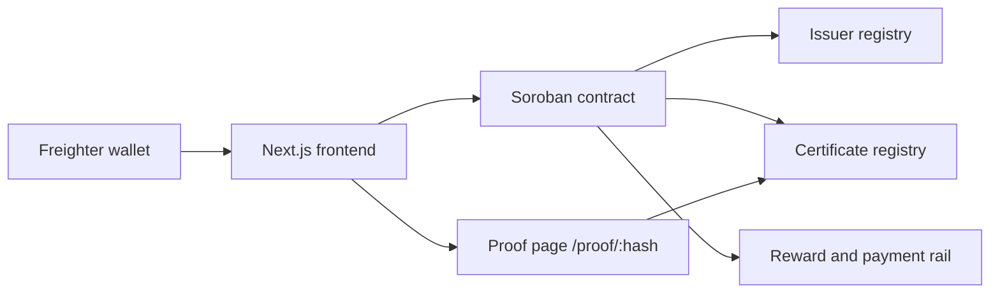
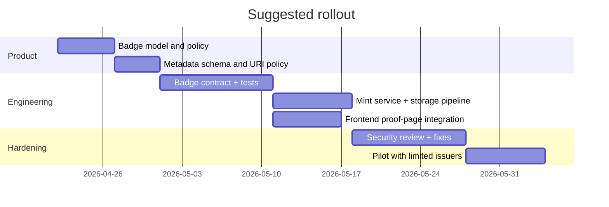

# NFT Minting Integration for Workshop-Stellaroid_Earn

## Executive Summary

`Workshop-Stellaroid_Earn` is already a functioning on-chain credential and payment application built around entity["company","GitHub","developer platform"] repository code that uses a Soroban smart contract on Stellar, a Next.js frontend, Freighter wallet integration, and public proof pages keyed by SHA-256 certificate hashes. The core contract already handles issuer registration and approval, certificate registration and lifecycle changes, admin-funded rewards, and employer-to-student payments. The frontend already has the right primitives for a badge system: wallet identity, certificate hashing, metadata URIs, public proof URLs, issuer trust state, and payment gating by verified credential status. There is **no existing NFT module** in the repo, and no EVM, Solana, or marketplace SDK currently installed. fileciteturn13file0L1-L1 fileciteturn15file0L1-L1 fileciteturn23file0L1-L1 fileciteturn27file0L1-L1

The strongest product conclusion is blunt: **NFT minting should not replace the repo’s current credential record**. The current Stellar certificate hash plus issuer-verification flow is the trust layer. If you force a transferable NFT to become the credential itself, you weaken the project’s core promise, because credentials are fundamentally about issuer claims and subject identity, not secondary-market tradability. The clean architecture is: **keep Stellar/Soroban as the source of truth, and add NFTs only as an optional badge layer**. For actual credential semantics, use a non-transferable or effectively locked badge pattern; for community growth or merch-like experiences, mint a separate transferable commemorative badge. This recommendation aligns with the repo’s trust-and-payment design and with the entity["organization","W3C","web standards body"] Verifiable Credentials model, which treats credentials as issuer-signed claims in an issuer-holder-verifier ecosystem, not as inherently tradable assets. fileciteturn13file0L1-L1 fileciteturn20file0L1-L1 fileciteturn21file0L1-L1 citeturn25search0turn6search3

My implementation recommendation is therefore two-stage. **Default path:** if you want the smallest integration cost and the least UX damage, add an NFT-like badge contract on Soroban or keep the badge purely inside the existing proof system first. **Marketplace path:** if public NFT discovery, creator earnings, or marketplace listing is a hard requirement, add a **sidecar minting service and a Polygon ERC-721 contract** that mints only after the Stellar credential reaches `Verified`. That gives you mature tooling and marketplace support while preserving Stellar as the canonical verification and payment rail. Ethereum mainnet is too expensive for this repo’s likely bootcamp / university / recruiting use cases; Solana is attractive for very large drops, but it would force a much larger wallet and infrastructure shift than Polygon; Flow has strong onboarding and gas sponsorship features, but it is still a much bigger departure from the current repo than extending Stellar or adding an EVM sidecar. citeturn5search0turn5search2turn6search0turn6search1turn7search0turn7search1turn13view0turn14view0turn18search2turn18search6

The practical business case is narrow but real. NFT minting is useful here when it improves **shareability, portfolio visibility, issuer branding, alumni/community engagement, access control, and optional creator-fee revenue**, or when a “verified work badge” gives graduates a portable artifact that can be displayed in wallet galleries and marketplace profiles. It is **not** useful if the team expects tradable NFTs to strengthen credential integrity by themselves, because they do not. The upside is measurable; the downside is also measurable: more wallets, more support burden, more security scope, and more legal/privacy exposure. fileciteturn27file0L1-L1 fileciteturn29file0L1-L1 citeturn6search2turn24search9turn25search0turn26search0

## Repository Findings from GitHub

The repo is a two-part system. The Rust contract in `contract/src/lib.rs` defines the trust and payment state machine: `init`, `register_issuer`, `approve_issuer`, `suspend_issuer`, `register_certificate`, `verify_certificate`, `revoke_certificate`, `suspend_certificate`, `reward_student`, `link_payment`, and read methods for issuer and certificate lookup. Certificates store `owner`, `issuer`, `title`, `cohort`, `metadata_uri`, `status`, and timestamps. Issuer state and certificate state are already explicit, which is exactly the data an NFT layer would need. Tests in `contract/src/test.rs` cover approved-issuer issuance, unauthorized verification, revocation blocking payment, and event emission. fileciteturn13file0L1-L1 fileciteturn14file0L1-L1

The frontend is a Next.js 15 / React 19 / TypeScript app with Tailwind, `@stellar/stellar-sdk`, and `@stellar/freighter-api`. `frontend/src/lib/contract-client.ts` already encapsulates transaction preparation, simulation, signing, raw RPC fallback handling, and normalized reads/writes for certificates and issuers. `frontend/src/lib/freighter.ts` and `frontend/src/hooks/use-freighter-wallet.tsx` provide the wallet state layer. `frontend/src/components/actions/register-form.tsx` computes SHA-256 hashes from uploaded files, captures optional `title`, `cohort`, and `metadataUri`, and writes certificate registrations. `verify-form.tsx` reads chain state and can verify, suspend, or revoke; `pay-form.tsx` pays a verified student. That is already a complete “mint eligibility pipeline.” fileciteturn15file0L1-L1 fileciteturn22file0L1-L1 fileciteturn23file0L1-L1 fileciteturn24file0L1-L1 fileciteturn19file0L1-L1 fileciteturn20file0L1-L1 fileciteturn21file0L1-L1

The public proof layer is already strong. `frontend/src/app/proof/[hash]/page.tsx` renders a server-side proof page keyed by the certificate hash, validates only 64-hex inputs, revalidates every 60 seconds, and reads issuer and certificate data server-side. `frontend/src/lib/proof-metadata.ts` will fetch remote metadata only from `https://` URIs and otherwise merges on-chain fields with local metadata. `frontend/src/components/proof/proof-card.tsx` already exposes the proof URL, issuer state, technical details, explorer links, and sharing affordances. In plain terms: the repo already has the public-facing artifact that NFT metadata should point to; you do not need to invent this from scratch. fileciteturn27file0L1-L1 fileciteturn28file0L1-L1 fileciteturn29file0L1-L1 fileciteturn36file0L1-L1

The issuer trust layer is also already present. `frontend/src/app/issuer/page.tsx`, `frontend/src/components/issuer/issuer-dashboard.tsx`, `frontend/src/app/issuer/register/page.tsx`, `frontend/src/app/issuer/register/register-experience.tsx`, and `frontend/src/components/issuer/issuer-register-form.tsx` implement issuer registration, approval/suspension visibility, and admin controls keyed to `NEXT_PUBLIC_STELLAR_ADMIN_ADDRESS`. This matters because NFT mint authorization should follow the **same trust model** as issuer approval, not invent a second governance system. fileciteturn30file0L1-L1 fileciteturn31file0L1-L1 fileciteturn32file0L1-L1 fileciteturn33file0L1-L1 fileciteturn34file0L1-L1

The repo also shows some security discipline that an NFT integration should preserve. `frontend/next.config.ts` sets CSP and other headers; `proof-metadata.ts` only fetches remote metadata from `https://` URLs; the proof route rejects malformed hashes before making RPC calls; and the client normalizes contract errors instead of leaking raw XDR/ScVal errors to users. Those are good patterns to keep when adding NFT minting and marketplace integrations. fileciteturn39file0L1-L1 fileciteturn29file0L1-L1 fileciteturn27file0L1-L1 fileciteturn23file0L1-L1

The exact file paths I referenced are below.

| File path | Why it matters for NFT integration |
|---|---|
| `README.md` | High-level project framing and architecture |
| `contract/Cargo.toml` | Soroban SDK / contract build context |
| `contract/src/lib.rs` | Core issuer / certificate / payment logic |
| `contract/src/test.rs` | Existing behavioral guarantees |
| `frontend/package.json` | Actual frontend stack; confirms no NFT tooling yet |
| `frontend/.env.example` | Current Stellar config surface |
| `frontend/next.config.ts` | Security headers and CSP |
| `frontend/src/app/app/page.tsx` | Main app entry |
| `frontend/src/app/app/app-experience.tsx` | Main user flow orchestration |
| `frontend/src/app/issuer/page.tsx` | Issuer dashboard route |
| `frontend/src/app/issuer/register/page.tsx` | Issuer registration route |
| `frontend/src/app/issuer/register/register-experience.tsx` | Wallet-gated issuer registration experience |
| `frontend/src/app/proof/[hash]/page.tsx` | Public proof route and SSR read path |
| `frontend/src/components/actions/register-form.tsx` | Certificate hashing and metadata capture |
| `frontend/src/components/actions/verify-form.tsx` | Verification lifecycle UI |
| `frontend/src/components/actions/pay-form.tsx` | Payment UI |
| `frontend/src/components/issuer/issuer-dashboard.tsx` | Issuer/admin trust controls |
| `frontend/src/components/issuer/issuer-register-form.tsx` | Issuer profile creation |
| `frontend/src/components/proof/proof-card.tsx` | Shareable proof artifact |
| `frontend/src/hooks/use-freighter-wallet.tsx` | Existing wallet state layer |
| `frontend/src/lib/config.ts` | Network config and feature toggles |
| `frontend/src/lib/contract-client.ts` | Soroban transaction/read abstraction |
| `frontend/src/lib/contract-read-server.ts` | Server-side proof reads |
| `frontend/src/lib/freighter.ts` | Wallet signing integration |
| `frontend/src/lib/issuer-registry.ts` | Existing trust-list pattern |
| `frontend/src/lib/proof-metadata.ts` | Metadata resolution and safety checks |
| `frontend/src/lib/types.ts` | Shared domain types |

The table above is drawn from the files I inspected directly in the repo. fileciteturn7file0L1-L1 fileciteturn37file0L1-L1 fileciteturn13file0L1-L1 fileciteturn14file0L1-L1 fileciteturn15file0L1-L1 fileciteturn16file0L1-L1 fileciteturn39file0L1-L1 fileciteturn17file0L1-L1 fileciteturn18file0L1-L1 fileciteturn30file0L1-L1 fileciteturn31file0L1-L1 fileciteturn33file0L1-L1 fileciteturn27file0L1-L1 fileciteturn19file0L1-L1 fileciteturn20file0L1-L1 fileciteturn21file0L1-L1 fileciteturn32file0L1-L1 fileciteturn34file0L1-L1 fileciteturn36file0L1-L1 fileciteturn22file0L1-L1 fileciteturn25file0L1-L1 fileciteturn23file0L1-L1 fileciteturn28file0L1-L1 fileciteturn24file0L1-L1 fileciteturn35file0L1-L1 fileciteturn29file0L1-L1 fileciteturn26file0L1-L1



## Strategic Fit of NFT Minting

For this repo, NFT minting is useful only if it is treated as a **presentation and engagement layer**, not the canonical credential. The existing Stellar certificate is already the canonical proof because it binds issuer, owner, hash, status, and payment eligibility. A badge NFT can extend that by creating a wallet-native artifact that users can display, share, and optionally trade. That is useful for bootcamps, hackathons, community quests, alumni membership, verified portfolio milestones, and branded issuer recognition. It is especially useful because the repo already has `title`, `cohort`, `metadata_uri`, public proof URLs, and issuer trust state. fileciteturn13file0L1-L1 fileciteturn19file0L1-L1 fileciteturn27file0L1-L1 fileciteturn29file0L1-L1

It is **not** strategically sound to let a transferable NFT become the sole record of a certification or work-proof claim. The reason is simple: a transferable NFT can move independently of the real credential subject, while the core repo logic assumes the credential belongs to a specific owner address and gates downstream payments based on verified status. The better pattern is one of these: a non-transferable credential NFT, a locked ERC-721 using a soulbound-style interface, or a separate transferable “commemorative” collection that points back to the real Stellar proof page. That separation is cleaner both technically and product-wise. fileciteturn13file0L1-L1 citeturn6search3turn25search0

The repo’s strongest NFT use cases are therefore these. First, **verified completion badges** for bootcamps or university programs. Second, **employer-issued proof-of-work badges** that attach to a trainee’s portfolio. Third, **issuer-branded alumni access or event passes**, where the NFT is a membership artifact and the underlying credential remains canonical on Stellar. Fourth, **collectible moments** tied to cohorts, hackathon wins, or milestone submissions, where tradability is fine because the NFT is intentionally not the legal or academic credential. That distinction is the whole game. fileciteturn29file0L1-L1 fileciteturn32file0L1-L1 citeturn25search0turn6search2

## Platform and Standard Comparison

The repo’s current chain is Stellar/Soroban, so the default integration choice is “same-chain first.” But if the real goal is external NFT marketplace visibility, the best pragmatic addition is Polygon, not Ethereum mainnet.

| Platform | Fit with current repo | Wallet / UX impact | Cost profile | Marketplace reality | Verdict |
|---|---|---|---|---|---|
| **Stellar / Soroban** | Highest technical fit; same wallet, same contract model, same proof/payment chain | Lowest disruption; keeps Freighter | Low, but less standardized for NFT-marketplace distribution | Weaker NFT marketplace reach than mature EVM ecosystems | Best if the badge is mainly for proof, gating, or issuer UX |
| **Polygon** | Strong frontend fit because Next.js/TS tooling ports easily; repo still needs new wallet/provider layer | Moderate; adds EVM wallet or relayer path | Low relative to Ethereum; EVM-compatible | Strong for NFT distribution and mature EVM tooling | Best sidecar if marketplace reach matters |
| **Ethereum mainnet** | Technically easy for EVM devs, but operationally expensive | Moderate-high; new wallet layer plus fee pain | Highest and most congestion-sensitive | Strongest ecosystem, worst cost profile | Bad default for this project |
| **Solana** | Good NFT ecosystem, but low compatibility with current wallet and contract model | High; requires new wallet, SDK, indexing model | Very low; compressed NFTs are extremely cheap | Strong with entity["company","Magic Eden","nft marketplace"]; mixed elsewhere | Strong only if you want mass-scale minting and are willing to re-architect |
| **Flow** | Separate ecosystem; lower direct compatibility with current repo | High if you switch fully; lower if you build a parallel app | Low-cost and strong gas sponsorship options | Supported by entity["company","OpenSea","nft marketplace"] and native Flow tooling | Interesting for mainstream onboarding, but not the natural extension of this repo |

Source basis for the platform comparison: current repo stack and wallet model, Stellar smart-contract and NFT docs, EIP standards, Solana fee docs, Flow EVM fee and gasless docs, and marketplace support docs. fileciteturn15file0L1-L1 fileciteturn22file0L1-L1 fileciteturn23file0L1-L1 citeturn5search0turn5search2turn6search0turn6search1turn7search0turn7search1turn13view0turn14view0turn18search2turn18search6turn24search2

For standards, the clean mapping is straightforward.

| Standard | Best use in this repo | Strengths | Weaknesses | Recommendation |
|---|---|---|---|---|
| **ERC-721** | Unique credential badge per verified certificate | Most widely supported NFT standard; simple uniqueness model | Transferability is wrong by default for credentials | Use for optional sidecar badge |
| **ERC-1155** | Cohort or edition badges where many users get the same class of asset | Batch minting, lower overhead per class, good for programs/events | Slightly less intuitive for “this badge is *my* credential” | Use for commemorative / cohort badges |
| **ERC-2981** | Royalty signaling for secondary sales | Standard royalty interface across ERC-721/1155 | Royalties remain marketplace-policy-dependent | Add only for transferable collectibles |
| **ERC-5192** | Soulbound or locked credential badge | Signals non-transferability cleanly on top of ERC-721 | No resale; weaker marketplace use by design | Best fit for actual credentials |
| **Metaplex Core / Bubblegum V2** | Solana-native badges at scale | Very low mint cost; Core and compressed NFT support; strong scale | Would require Solana wallet and indexing stack | Only if you intentionally choose Solana |
| **Flow NonFungibleToken + MetadataViews** | Flow-native badges | Standardized Flow NFT stack and metadata | Requires leaving current chain and wallet model | Not recommended for this repo’s first NFT phase |
| **Soroban custom NFT / Stellar example contracts** | Same-chain badge tied to existing Stellar credential flow | Best architectural continuity | Less mature wallet/gallery/marketplace expectations than EVM | Best for v1 if external trading is not the goal |

Sources: ERC EIPs, Stellar NFT docs, Metaplex docs, and Flow core contract docs. citeturn6search0turn6search1turn6search2turn6search3turn5search2turn14view3turn18search2turn18search6

### Recommended platform decision

The recommendation is **not** “pick an NFT chain and move the app.” The recommendation is:

1. **Keep Stellar/Soroban as the canonical credential + payment layer.**
2. **Mint only after `verify_certificate` succeeds.**
3. **Treat the NFT as an optional badge projection of the verified credential.**
4. **If you need marketplace-grade NFTs, use Polygon sidecar ERC-721/5192.**
5. **If you only need proof/access/gamification, stay on Soroban first.**

That is the cleanest architecture for this codebase. fileciteturn13file0L1-L1 fileciteturn18file0L1-L1 citeturn5search0turn5search2turn7search0turn6search3

## Integration Architecture and Code

There are three viable integration patterns, and only one of them is truly clean for this repo.

The first is **frontend direct minting**. After certificate verification, the user connects a second wallet and signs an NFT mint transaction from the browser. This is the simplest implementation, but it is the worst UX because the repo currently assumes one wallet path through Freighter. The second is **backend-relayed minting**, where a trusted service watches for `cert_ver` events or consumes verification success callbacks, checks that the Stellar certificate is truly verified, uploads metadata, and mints the NFT through a relayer or server wallet. This is the best fit if you want gas sponsorship or issuer-controlled minting. The third is **claim-based minting**, where the backend marks a verified hash as eligible and the user claims later; this gives more user agency and lower backend spend, but creates one more step. Given the repo’s current trust flow, the **backend-relayed pattern** is the best default. fileciteturn13file0L1-L1 fileciteturn20file0L1-L1 citeturn22search1turn23search2turn19search2

```mermaid
flowchart TD
  A[Issuer verifies certificate on Stellar] --> B[Stellar cert status = Verified]
  B --> C[Mint service checks get_certificate(hash)]
  C --> D[Build NFT metadata JSON]
  D --> E[Upload metadata to IPFS or Arweave]
  E --> F[Mint Polygon badge NFT]
  F --> G[Store tokenId and chain mapping off-chain]
  G --> H[Show badge link on proof page]
  H --> I[Optional marketplace listing]
```

The repo’s existing `frontend/src/lib/contract-client.ts` and `frontend/src/components/actions/verify-form.tsx` are the natural insertion points. You already have a successful verification callback and a typed certificate read path. The clean addition is a new module like `frontend/src/lib/nft-client.ts` plus a server action or API route that receives `certHash`, reads the Stellar certificate again, rejects anything not `verified`, then mints. fileciteturn20file0L1-L1 fileciteturn23file0L1-L1

### Suggested library stack

| Layer | Best-fit choice | Why |
|---|---|---|
| EVM contract interaction | `ethers` | Mature, compact, widely used in TS apps |
| EVM wallet/connect | entity["company","MetaMask","crypto wallet"] Connect or WalletConnect-compatible UI | Fastest path if you require user-signed EVM txs |
| Gasless / embedded wallets | entity["company","thirdweb","web3 developer platform"] or OpenZeppelin relayer stack | Faster UX for non-crypto users |
| Contract library | entity["company","OpenZeppelin","smart contract tooling"] | Practical defaults for ERC-721, roles, royalties, pausing, ERC-2771 |
| NFT indexing / reads | entity["company","Alchemy","blockchain api provider"] or entity["company","Infura","blockchain api provider"] | Faster metadata / owner / collection reads than self-indexing |
| Solana path | Metaplex | Canonical Solana NFT stack |
| Avoid for new work | web3.js | The official docs say the libraries are being sunset |

Sources: official docs for ethers, web3.js, MetaMask, thirdweb, OpenZeppelin, Alchemy, and Infura. citeturn15search9turn15search0turn20search0turn19search0turn19search2turn16search2turn22search0turn23search2turn17search1turn21search3turn21search4

### Sample EVM sidecar contract

The contract below is deliberately aligned with the repo’s trust model: one NFT per verified certificate hash, explicit issuer/admin control, metadata URI support, revocation, royalties, and optional non-transferability.

```solidity
// SPDX-License-Identifier: MIT
pragma solidity ^0.8.24;

import "@openzeppelin/contracts/token/ERC721/ERC721.sol";
import "@openzeppelin/contracts/token/common/ERC2981.sol";
import "@openzeppelin/contracts/access/AccessControl.sol";
import "@openzeppelin/contracts/utils/Pausable.sol";

contract StellaroidCredentialBadge is ERC721, ERC2981, AccessControl, Pausable {
    bytes32 public constant MINTER_ROLE = keccak256("MINTER_ROLE");
    bytes32 public constant REVOKER_ROLE = keccak256("REVOKER_ROLE");
    bytes32 public constant PAUSER_ROLE = keccak256("PAUSER_ROLE");

    uint256 public nextTokenId = 1;

    struct Badge {
        bytes32 certHash;
        string tokenUri;
        bool locked;      // soulbound-style
        bool revoked;
    }

    mapping(uint256 => Badge) public badges;
    mapping(bytes32 => uint256) public tokenIdByCertHash;

    error AlreadyMinted();
    error Soulbound();
    error Revoked();

    constructor(address admin, address royaltyReceiver, uint96 royaltyBps)
        ERC721("Stellaroid Verified Badge", "SVB")
    {
        _grantRole(DEFAULT_ADMIN_ROLE, admin);
        _grantRole(MINTER_ROLE, admin);
        _grantRole(REVOKER_ROLE, admin);
        _grantRole(PAUSER_ROLE, admin);
        _setDefaultRoyalty(royaltyReceiver, royaltyBps);
    }

    function mintForVerifiedCredential(
        address to,
        bytes32 certHash,
        string calldata uri,
        bool locked
    ) external onlyRole(MINTER_ROLE) whenNotPaused returns (uint256 tokenId) {
        if (tokenIdByCertHash[certHash] != 0) revert AlreadyMinted();

        tokenId = nextTokenId++;
        tokenIdByCertHash[certHash] = tokenId;
        badges[tokenId] = Badge({
            certHash: certHash,
            tokenUri: uri,
            locked: locked,
            revoked: false
        });

        _safeMint(to, tokenId);
    }

    function revoke(uint256 tokenId) external onlyRole(REVOKER_ROLE) {
        badges[tokenId].revoked = true;
    }

    function tokenURI(uint256 tokenId) public view override returns (string memory) {
        if (badges[tokenId].revoked) revert Revoked();
        return badges[tokenId].tokenUri;
    }

    function pause() external onlyRole(PAUSER_ROLE) { _pause(); }
    function unpause() external onlyRole(PAUSER_ROLE) { _unpause(); }

    function _update(address to, uint256 tokenId, address auth)
        internal
        override
        whenNotPaused
        returns (address from)
    {
        from = _ownerOf(tokenId);
        if (from != address(0) && to != address(0) && badges[tokenId].locked) {
            revert Soulbound();
        }
        return super._update(to, tokenId, auth);
    }

    function supportsInterface(bytes4 interfaceId)
        public
        view
        override(ERC721, ERC2981, AccessControl)
        returns (bool)
    {
        return super.supportsInterface(interfaceId);
    }
}
```

This pattern follows the standards and library building blocks from ERC-721, ERC-2981, ERC-5192-style locking semantics, and OpenZeppelin’s access-control and meta-transaction utilities. citeturn6search0turn6search2turn6search3turn22search0turn16search2turn23search2

### Sample Next.js server-side mint trigger adapted to the repo

```ts
// app/api/nft/mint/route.ts
import { NextRequest, NextResponse } from "next/server";
import { BrowserProvider, Contract, JsonRpcProvider, Wallet } from "ethers";
import badgeAbi from "@/lib/abi/StellaroidCredentialBadge.json";
import { getCertificate } from "@/lib/contract-client"; // existing repo module

const NFT_RPC_URL = process.env.NFT_RPC_URL!;
const NFT_CONTRACT = process.env.NFT_CONTRACT_ADDRESS!;
const MINTER_KEY = process.env.NFT_MINTER_PRIVATE_KEY!;

export async function POST(req: NextRequest) {
  const { certHash, owner, metadataUri } = await req.json();

  const cert = await getCertificate(certHash);
  if (!cert) {
    return NextResponse.json({ error: "Certificate not found" }, { status: 404 });
  }

  if (cert.status !== "verified") {
    return NextResponse.json(
      { error: `Certificate status is ${cert.status}; mint blocked` },
      { status: 400 }
    );
  }

  if (cert.owner.toUpperCase() !== owner.toUpperCase()) {
    return NextResponse.json({ error: "Owner mismatch" }, { status: 400 });
  }

  const provider = new JsonRpcProvider(NFT_RPC_URL);
  const signer = new Wallet(MINTER_KEY, provider);
  const contract = new Contract(NFT_CONTRACT, badgeAbi, signer);

  const certHashBytes = `0x${certHash.replace(/^0x/i, "")}`;
  const tx = await contract.mintForVerifiedCredential(
    owner,
    certHashBytes,
    metadataUri,
    true // locked badge by default
  );

  const receipt = await tx.wait();

  return NextResponse.json({
    ok: true,
    txHash: receipt?.hash ?? tx.hash,
  });
}
```

That route intentionally reuses the repo’s existing certificate-read path instead of trusting client input. It is the right habit.

## Security, UX, Legal, and Marketplace Implications

The security posture for NFT minting here should be stricter than the current repo, not looser, because you are expanding the attack surface from one chain and one wallet model to potentially two. At minimum, the NFT layer should enforce one-mint-per-cert-hash, mint-only-after-verified, issuer/admin role separation, paused emergency stops, metadata immutability rules, replay protection for relayed mints, and explicit revocation semantics. Do **not** make the NFT the sole authority for status; the repo’s current Stellar certificate should remain authoritative. fileciteturn13file0L1-L1 fileciteturn39file0L1-L1 citeturn22search0turn16search2turn23search2

A practical audit checklist for this project is short and non-negotiable. Verify role boundaries. Fuzz duplicate mint and revocation paths. Test front-running around claim-based mints. Verify that metadata URIs cannot be swapped silently after issuance unless the product explicitly allows updates. Confirm that badge minting cannot occur for `Issued`, `Suspended`, `Revoked`, or `Expired` credentials. Test pause/recovery playbooks. Review any relayer or server-wallet secret handling. The repo’s existing tests prove discipline on the Stellar side, but you would need a separate NFT test suite and likely an external audit before production. fileciteturn14file0L1-L1 citeturn22search0turn22search1

On UX, the repo currently uses Freighter and already handles onboarding limits such as unsupported browser/mobile cases. If you add an EVM NFT path, the rawest version of the truth is this: **adding a second wallet will hurt conversion**. If you want non-crypto students or employers to use this, you either need a relayer-based backend mint, an embedded wallet approach, or a claim flow that hides gas. MetaMask now pushes both self-custodial connection and embedded-wallet options, and thirdweb explicitly supports in-app wallets, account abstraction, and gasless transaction sponsorship; Flow also highlights native sponsorship and gasless-style onboarding on both testnet and mainnet. Those are real UX levers if this becomes a consumer-facing onboarding product rather than a hackathon demo. fileciteturn22file0L1-L1 citeturn20search0turn19search0turn19search2turn14view0

For metadata storage, the sensible pattern is to keep **sensitive or mutable evidence off-chain**, keep only hashes and durable pointers on-chain, and use NFT metadata JSON that points back to the existing proof page and an immutable media URI. IPFS is content-addressed and requires pinning or pinning services for persistence; Arweave is designed for permanent decentralized storage. For this project, the clean split is: proof page on your existing app, metadata JSON and image on IPFS or Arweave, and the chain record storing only URIs and hashes. Never put raw personal data on-chain if it can be avoided. fileciteturn29file0L1-L1 citeturn9search4turn9search7turn10search0turn10search3

Marketplace support is not uniform, so chain choice matters immediately.

| Marketplace | Practical fit | What matters here |
|---|---|---|
| **OpenSea** | Best for EVM/Flow visibility | Supports Ethereum, Polygon, Flow, and others; its help docs currently say Solana is supported for token swapping but **not NFTs** there right now |
| **Rarible** | Good multi-chain API and embedded flows | Strong dev API posture and wide chain support including Ethereum and Polygon |
| **Magic Eden** | Best for Solana; also has EVM APIs | Strong if you choose Solana or want EVM + Solana marketplace tooling |

Sources: official marketplace help and docs. citeturn7search0turn9search0turn24search11turn24search0turn24search2

On royalties, be realistic. ERC-2981 standardizes royalty signaling, but whether royalties are actually enforced depends on marketplace policy and collection settings. If you choose to create a **transferable commemorative collection**, royalties can become a meaningful upside. If you choose a locked credential badge, royalties are mostly irrelevant because there should be no secondary market at all. In other words: royalties belong to the collectible layer, not the credential layer. citeturn6search2turn24search9turn24search6

On legal and regulatory exposure, there are three issues you should not ignore. First, if you market NFTs primarily as profit opportunities or build a strong expectation of secondary-market gains, securities analysis gets harder; the entity["organization","U.S. Securities and Exchange Commission","us regulator"] framework explicitly focuses on expectation of profits, managerial efforts of others, and secondary-market promotion. Second, credentials are not the same thing as collectibles; the W3C credential model is about issuer claims, holders, and verifiers, which strengthens the case for keeping the credential authoritative outside the tradable token itself. Third, privacy matters: if the NFT or metadata contains identifiable student information, that creates unnecessary legal risk because blockchain records are hard to change. The safe strategy is minimal on-chain personal data, explicit issuer terms, and a clear badge license / credential policy. citeturn26search0turn26search1turn25search0

## Roadmap, Testing, KPIs, and Migration

The implementation roadmap should be staged, because jamming NFT minting into this repo all at once is how teams create fake progress and real bugs. The correct sequence is: preserve source-of-truth semantics first, then add metadata and minting, then add marketplace polish.

| Phase | Scope | Estimated effort | Exit criteria |
|---|---|---:|---|
| Discovery | Finalize badge model: locked credential badge vs transferable commemorative badge | 3–5 days | Product spec approved |
| Data design | Define metadata JSON schema and proof-page linkage | 2–4 days | Schema and URI policy approved |
| Smart contracts | Build and test badge contract / sidecar mint service | 1–2 weeks | Unit tests pass; duplicate-mint and revocation paths covered |
| Frontend integration | Add badge status to proof page and verify flow | 4–7 days | Verified cert can trigger mint or claim |
| Indexing / ops | Metadata upload, mint job queue, explorer / marketplace links | 4–7 days | End-to-end happy path stable |
| Security hardening | Threat modeling, test expansion, review, pre-audit cleanup | 1–2 weeks | Critical issues closed |
| Pilot launch | Small issuer cohort | 1 week | Real-user KPI baseline collected |



The testing plan should mirror the repo’s current discipline. On-chain tests should cover one-mint-per-hash, locked transfer rejection, revocation visibility, pause behavior, role restrictions, and royalty info. Frontend tests should cover mint CTA visibility, proof-page badge rendering, wrong-wallet handling, failure states, and latency under RPC retries. Integration tests should cover the whole sequence from `register_certificate` → `verify_certificate` → metadata upload → NFT mint → proof-page update. Marketplace tests should verify collection metadata, image rendering, contract verification, and creator-earnings configuration on the chosen platform. fileciteturn14file0L1-L1 fileciteturn27file0L1-L1 citeturn24search4turn24search9turn9search0turn24search2

Backward compatibility is manageable if you do **not** mutate the existing Stellar credential schema unnecessarily. The safest migration path is to leave the current contract alone and store NFT linkage off-chain first, keyed by `certHash`. Existing proof pages can then surface badge links without any on-chain Stellar schema migration. If later you want strong on-chain linkage, add a new Soroban extension or a companion registry contract rather than modifying the current certificate struct in-place. That preserves compatibility with existing proof URLs, existing issuer flows, and existing payment logic. fileciteturn13file0L1-L1 fileciteturn27file0L1-L1

The KPI set should be brutally concrete. Track **verification-to-mint rate**, **mint success rate**, **median time from verification to badge availability**, **proof-page clickthrough to badge view**, **wallet connection success**, **mint cost per user**, **support tickets per 100 mints**, **issuer activation rate**, and, only if you choose a transferable commemorative layer, **secondary sale count / royalty receipts**. The core business KPI for this repo is still not “NFT sales”; it is whether verified students become easier to trust, easier to pay, and easier to showcase. That is the standard to judge the feature by. fileciteturn21file0L1-L1 fileciteturn27file0L1-L1 citeturn6search2turn24search9

The final recommendation is this: **integrate NFTs only as an optional badge layer, keep Stellar/Soroban as the canonical credential rail, and use Polygon as the external marketplace sidecar only if marketplace visibility is a hard requirement**. If you cannot articulate exactly why tradability helps your issuer/student/employer loop, do not ship a tradable NFT. Ship a locked badge or no NFT at all. That is the analytically correct answer for this repo as it exists today.